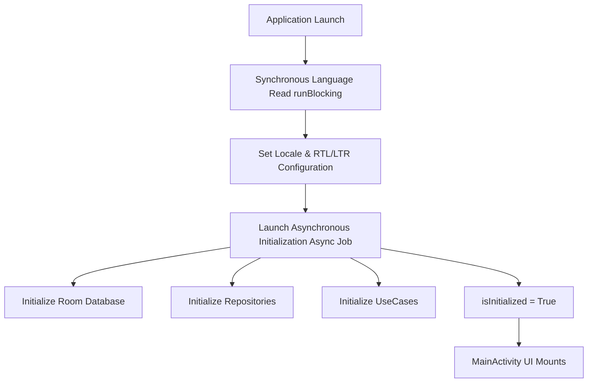

# 00_PROJECT_OVERVIEW — نظرة عامة على المشروع / Project Overview

## نبذة عن المشروع / Overview

### ما هو تطبيق HabitFlow؟
تطبيق **HabitFlow** هو تطبيق أندرويد متكامل لتتبع العادات وبنائها محلياً (Offline-First)، تم بناؤه باستخدام لغة Kotlin وواجهات Jetpack Compose التفاعلية. يركز التطبيق على تزويد المستخدمين بتجربة تفاعلية وراقية تعتمد على التصاميم الزجاجية (Glassmorphism) والمؤثرات البصرية الديناميكية، لمساعدتهم في تتبع إنجازاتهم اليومية، وجدولة التذكيرات الصوتية العائمة، ومزامنة قطع الواجهة التفاعلية (Widgets) على الشاشة الرئيسية، مع دعم كامل للغتين العربية والإنجليزية واتجاهات النصوص التلقائية (RTL).

### What is HabitFlow?
**HabitFlow** is a premium, local-first Android habit-tracking application built with Kotlin and Jetpack Compose. Designed with rich glassmorphism aesthetics and smooth animations, it empowers users to build and maintain habits. The application features customizable daily schedules, reliable floating overlay audio alarms, dynamic home screen Glance widgets, and robust support for both Arabic and English locales (with automatic RTL mirroring).

---

## أهداف المنتج البرمجية / Product Objectives

* **بناء عادات مستدامة / Sustainable Habit Building**: تمكين المستخدم من جدولة عاداته الأسبوعية واختيار الألوان المفضلة وسياقات التذكير.
* **العمل دون اتصال بالإنترنت (Local-First)**: يتم تخزين كافة البيانات محلياً على قاعدة بيانات SQLite مشفرة ومؤمنة دون الاعتماد على خوادم سحابية.
* **المظهر الفاخر والتأثيرات الزجاجية (Glassmorphism)**: تقديم واجهة مستخدم متطورة تحتوي على تحريكات سلسة ومؤثرات زجاجية شبه شفافة.
* **التذكيرات فائقة الموثوقية (Reliable Alarms)**: الاعتماد على نظام ذكي يدمج بين العمال الخلفيين والخدمات الأمامية والمنبهات لضمان عدم تفويت التنبيهات حتى عند قفل الشاشة أو إعادة تشغيل الجهاز.

* **Sustainable Habit Building**: Users schedule habits on specific days of the week, customize visual coloring, and manage schedules dynamically.
* **Local-First Architecture**: All user data resides in a local SQLite database using Room, requiring zero internet dependency or cloud servers.
* **Premium Aesthetics**: Features a modern glassmorphism design language with subtle gradients, dynamic borders, and smooth UI animations.
* **Reliability Engineering**: Leverages a robust synchronization chain combining foreground services, WorkManager, and dynamic receivers to trigger audio reminders reliably.

---

## مواصفات التشغيل والتهيئة / Technical Specifications

* **Compile SDK**: 36 (استهداف أحدث واجهات برمجية لنظام أندرويد / Target OS SDK)
* **Min SDK**: 24 (أندرويد 7.0 وما فوق / Nougat+)
* **Target SDK**: 36 (الحد الأقصى للتوافق التام / Target compatibility)
* **Android Gradle Plugin (AGP)**: 9.1.1
* **Kotlin Version**: 2.2.10

---

## بنية التشغيل المحلي / Runtime & State Flow

تتحكم فئة `HabitApplication` بدورة حياة التهيئة. يتم قراءة تفضيلات المستخدم للغة فوراً بشكل متزامن `runBlocking` لتطبيق اتجاه النصوص RTL أو Ltr لتجنب التحديثات المتقطعة للغة (Language Flashing)، بينما يتم تهيئة قاعدة البيانات Room ومستودع البيانات UseCases بشكل غير متزامن `CoroutineScope.async` خلف الستار للحفاظ على سرعة الاستجابة.

`HabitApplication` controls the startup lifecycle. User language options are fetched synchronously using `runBlocking` to enforce correct layout direction (RTL/LTR) instantly on draw, while database, repositories, and use case layers initialize asynchronously inside a `CoroutineScope.async` block.

---

## قسم التحقق والأدلة / Verification & Evidence

* **Confidence Score / نسبة الثقة**: 100%
* **Evidence / الأدلة**:
  - فئة `HabitApplication` الممثلة لنقطة انطلاق التطبيق والتهيئة غير المتزامنة.
  - ملف البناء `app/build.gradle.kts` الذي يوثق إصدارات التشغيل ومستويات compileSdk و targetSdk.
* **Files Used / الملفات المستخدمة**:
  - [HabitApplication.kt](app/src/main/java/com/example/HabitApplication.kt#L11-L60)
  - [build.gradle.kts](app/build.gradle.kts#L9-L21)
* **Verification Status / حالة التحقق**: VERIFIED / مؤكد
