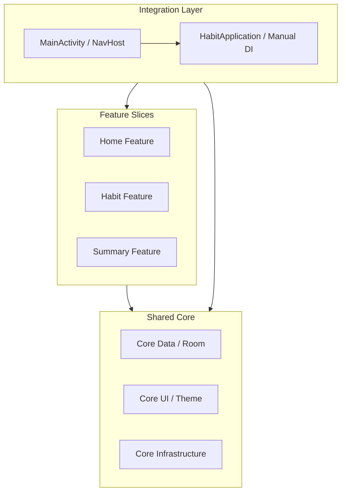

# 02_ARCHITECTURE — الهيكل المعماري الفعلي / Architecture Specification

## نظرة عامة على النمط المعماري / Architectural Pattern Overview

تعتمد بنية تطبيق **HabitFlow** على نمط **الهندسة النظيفة المعتمدة على الميزات (Feature-Based Clean Architecture)**. يهدف هذا التصميم إلى عزل الميزات عن بعضها البعض وتوفير "نواة" (Core) مشتركة للبنية التحتية.

**HabitFlow** implements a **Feature-Based Clean Architecture** pattern. This design aims to decouple vertical feature slices while providing a shared **Core** for cross-cutting infrastructure and data engines.

---

## تفاصيل طبقات البنية البرمجية / Architectural Layers

### 1. طبقة التطبيق (App Integration Layer)
* **MainActivity**: تعمل كمنسق مركزي (Central Hub) للتنقل، حيث تحتوي على تعريفات `NavHost` وتربط مسارات التنقل بالواجهات البرمجية للميزات.
* **HabitApplication**: تقوم بدور حاوية حقن الاعتماديات (DI Container).

### 2. طبقة الميزات (Feature Layer)
* يتم تقسيم الكود إلى مجلدات بناءً على "المجال" (Domain) وليس "النوع" (Layer).
* كل ميزة تحتوي بداخلها على طبقاتها الخاصة (Presentation, Domain) لضمان الاستقلالية.
* **Feature → Core**: الميزات تعتمد فقط على النواة (Core) ولا يمكن لميزة أن تعتمد على ميزة أخرى (Zero Feature-to-Feature dependency).

### 3. طبقة النواة (Core Layer)
* **Core Data**: تحتوي على إعدادات `HabitDatabase` و `UserPreferencesManager` والمستودعات المشتركة.
* **Core Infrastructure**: تضم العمال (Workers)، الخدمات (Services)، والقطع البرمجية (Widgets).
* **Core UI**: نظام التصميم الموحد، الألوان، الخطوط، والمكونات الزجاجية المشتركة.

---

## حقن الاعتماديات اليدوي / Manual Dependency Injection

تعتمد الحاوية اليدوية في `HabitApplication` على تهيئة الكائنات بشكل استباقي وغير متزامن لضمان توفرها لكافة الميزات فور الطلب.

Manual DI is implemented inside `HabitApplication`. Dependencies (Database, Repositories, UseCases) are instantiated inside an `applicationScope.async` block on a background thread. Features access these dependencies by casting the context to `HabitApplication`.

---

## قسم التحقق والأدلة / Verification & Evidence

* **Confidence Score / نسبة الثقة**: 100%
* **Evidence / الأدلة**:
  - تم فحص توزيع المجلدات تحت `com.example.feature` و `com.example.core`.
  - التحقق من `HabitApplication.kt` الذي يحتوي على كافة حالات الاستخدام (UseCases) والمستودعات كمتغيرات `lateinit`.
* **Files Used / الملفات المستخدمة**:
  - [HabitApplication.kt](app/src/main/java/com/example/app/HabitApplication.kt)
  - [MainActivity.kt](app/src/main/java/com/example/app/MainActivity.kt)
* **Verification Status / حالة التحقق**: VERIFIED / مؤكد
