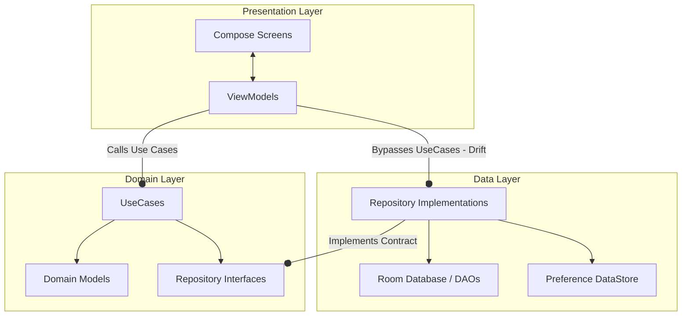

# 02_ARCHITECTURE — الهيكل المعماري الفعلي / Architecture Specification

## نظرة عامة على النمط المعماري / Architectural Pattern Overview

تعتمد بنية تطبيق **HabitFlow** على نمط **الهندسة النظيفة (Clean Architecture)** مدمجاً مع نمط **MVVM (Model-View-ViewModel)** لتنظيم تدفق البيانات وعزل المكونات الرسومية عن كود تخزين البيانات.

**HabitFlow** implements a hybrid **Clean Architecture** paired with **MVVM (Model-View-ViewModel)** to structure data flow and enforce isolation of business rules from database or visual design changes.



---

## تفاصيل طبقات البنية البرمجية / Architectural Layers

### 1. طبقة العرض (Presentation Layer)
* **المكونات الرسومية (Screens / Components)**: مبنية كلياً بـ Jetpack Compose. تلتزم بالـ Unidirectional Data Flow (UDF)؛ حيث تراقب الحالة المعروضة كـ `collectAsState()` وترسل تفاعلات المستخدم كأحداث برمجية إلى نموذج العرض (ViewModel).
* **نماذج العرض (ViewModels)**: ترث من `AndroidViewModel` للحصول على سياق التطبيق للوصول لحاويات DI اليدوية. تعبّر عن الحالة باستخدام `StateFlow` للأحجام المعقدة وتستخدم `mutableStateListOf` و`mutableStateMapOf` للعمليات الأكثر دقة لحفظ وتحديث عناصر القوائم (Row-level mutation) بشكل سريع لمنع Recomposition كامل للصفحة.

### 2. طبقة النطاق (Domain Layer)
* **قواعد العمل (UseCases)**: تمثل العمليات الفردية للتشغيل مثل `AddHabitUseCase` و `ValidateReminderTimeUseCase`.
* **نماذج البيانات النظيفة (Domain Models)**: تمثل كائنات التطبيق بشكل مستقل عن أندرويد أو مكتبة Room (مثل `Habit.kt`).
* **واجهات المستودع (Repository Contracts)**: واجهات تجريد تحدد عقود جلب البيانات مثل `interface HabitRepository`.

### 3. طبقة البيانات (Data Layer)
* **مستودعات البيانات (Repository Implementation)**: فئة `HabitRepositoryImpl.kt` تحقق عقود المستودعات وتنسق حركة البيانات والتحويل البرمجي بين كيانات قاعدة البيانات Room ونماذج النطاق النظيفة.
* **إدارة التخزين (Room & DataStore)**: تخزين الجداول وتحديثاتها والتحقق من المفضلات واللغات.

---

## حقن الاعتماديات اليدوي / Manual Dependency Injection

تمت إزالة مكتبات Hilt/Dagger كلياً لصالح **حاوية حقن يدوية** معرّفة داخل فئة `HabitApplication`.

Instead of Hilt or Dagger, dependencies are instantiated inside the `HabitApplication` onCreate callback. These variables are initialized asynchronously on an IO thread inside a coroutine. ViewModels and Workers lookup these properties by casting the Application context.

```kotlin
// HabitApplication.kt - Manual DI setup
_servicesReady = applicationScope.async(kotlinx.coroutines.Dispatchers.IO) {
    val database = HabitDatabase.getDatabase(this@HabitApplication)
    val repo = HabitRepositoryImpl(database.habitDao(), database.notificationDao())
    repository = repo
    // Initialize Use Cases
    getAllHabitsUseCase = GetAllHabitsUseCase(repo)
    addHabitUseCase = AddHabitUseCase(repo, this@HabitApplication)
    ...
    isInitialized = true
}
```

---

## انحراف التصميم المعماري الفعلي / Architectural Drift

### 🔴 الوصول المباشر للمستودعات من نماذج العرض / Direct Repository Access
تقوم نماذج العرض `HomeViewModel` و `AllHabitsViewModel` و `HabitDetailViewModel` باستدعاء المستودع `app.repository` بشكل مباشر لتنفيذ عمليات القراءة والتعديل العادية بدلاً من المرور عبر طبقة حالات الاستخدام (UseCases). 

ViewModels (specifically `HomeViewModel` and `AllHabitsViewModel`) bypass the UseCase layer, importing `app.repository` directly to perform simple CRUD queries or toggle completions. This is an architectural deviation from strict Clean Architecture, implemented to simplify boilerplate code.

---

## قسم التحقق والأدلة / Verification & Evidence

* **Confidence Score / نسبة الثقة**: 100%
* **Evidence / الأدلة**:
  - فحص الاستدعاءات داخل `HomeViewModel` و `AddHabitViewModel` و `HabitApplication` للتأكد من نمط تمرير المتغيرات lateinits والوصول المباشر لخصائص المستودع.
* **Files Used / الملفات المستخدمة**:
  - [HabitApplication.kt](app/src/main/java/com/example/HabitApplication.kt#L100-L127)
  - [HomeViewModel.kt](app/src/main/java/com/example/presentation/screens/home/HomeViewModel.kt#L98-L104)
  - [AddHabitUseCase.kt](app/src/main/java/com/example/domain/usecase/AddHabitUseCase.kt)
* **Verification Status / حالة التحقق**: VERIFIED / مؤكد
