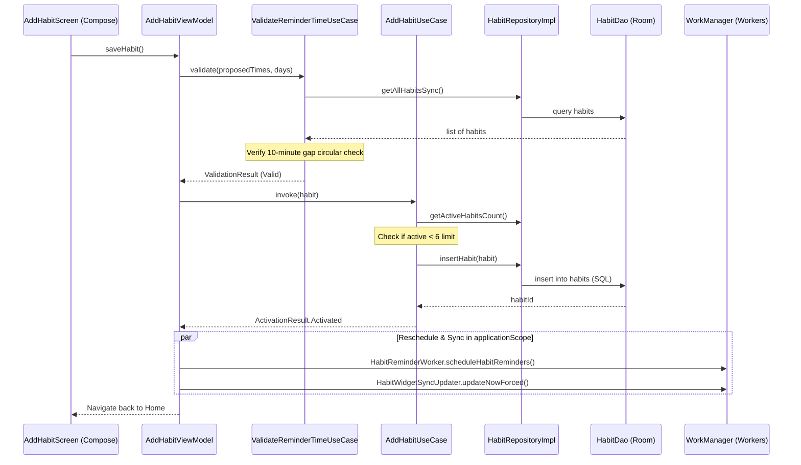
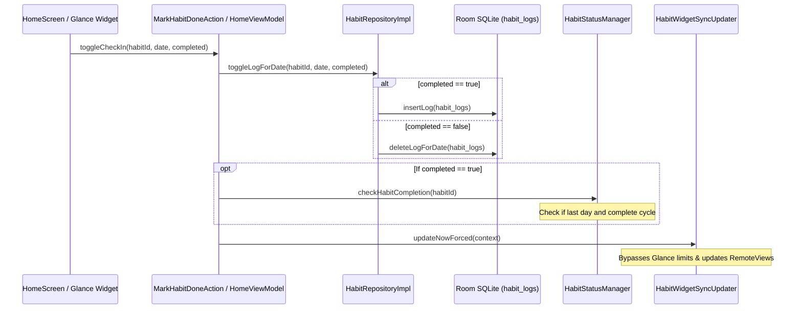
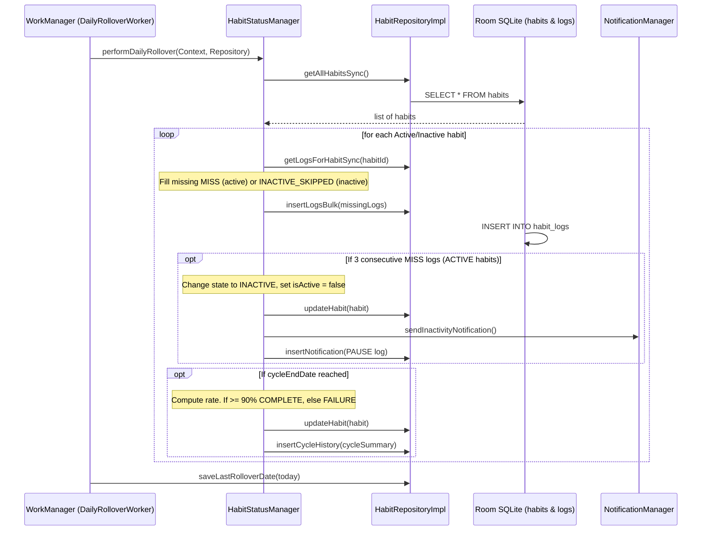

# 06_DATA_FLOW — مسارات تدفق البيانات / Interactive Data Flows

يوضح هذا المستند كيفية تدفق البيانات بين المكونات المختلفة للتطبيق (من الشاشة إلى قاعدة البيانات والخلفية) في أهم العمليات الحيوية:

This document details how data flows across layers (from UI to Database to Background Workers) for the main runtime operations:

---

## 1. مسار إضافة عادة جديدة / New Habit Creation Flow

عند قيام المستخدم بإدخال بيانات عادة جديدة والضغط على "حفظ":

When a user inputs new habit details and taps "Save":

---

## 2. مسار تسجيل الإنجاز اليومي بنقرة سريعة / Toggle Daily Check-in Flow

سواء تم تسجيل الإنجاز من لوحة التحكم أو من قطعة الواجهة التفاعلية (Widget):

Whether triggered from the Home Dashboard UI or a Glance Home Screen Widget:

---

## 3. مسار الالتفاف الليلي التلقائي / Nightly Auto-Rollover Flow

يحدث تلقائياً عند منتصف الليل لإعادة تعيين الحالة ومعالجة الغيابات والتوقف التلقائي:

Triggers automatically at 12:00 AM daily to log missing days, check auto-pauses, and archive completed cycles:

---

## قسم التحقق والأدلة / Verification & Evidence

* **Confidence Score / نسبة الثقة**: 100%
* **Evidence / الأدلة**:
  - تم التحقق من تتابع المكالمات البرمجية والتحريكات من فئات ViewModels وحالات الاستعمال ومستندات العمال.
* **Files Used / الملفات المستخدمة**:
  - [AddHabitViewModel.kt](app/src/main/java/com/example/presentation/screens/add/AddHabitViewModel.kt#L198-L283)
  - [HomeViewModel.kt](app/src/main/java/com/example/presentation/screens/home/HomeViewModel.kt#L157-L182)
  - [HabitStatusManager.kt](app/src/main/java/com/example/domain/usecase/HabitStatusManager.kt#L27-L103)
* **Verification Status / حالة التحقق**: VERIFIED / مؤكد
