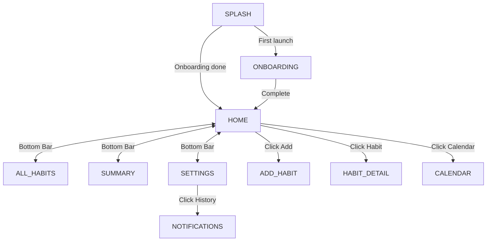

# 07_NAVIGATION — خريطة التنقل وشاشات التطبيق / Navigation Graph & Transitions

## مخطط شبكة التنقل للشاشات / Screen Navigation Map

تعتمد عملية الانتقال بين الشاشات العشر في تطبيق **HabitFlow** على مكتبة **Compose Navigation**. يتم تنظيم شجرة الوجهة بالشكل التالي:

The **HabitFlow** application hosts 10 screens managed in a single `NavHost` inside `MainActivity.kt`. Here is the navigation hierarchy:



---

## تفاصيل مسارات ووسائط التنقل / Route Definitions & Screen Arguments

تُعرّف المسارات البرمجية في فئة كائنات `Routes.kt`:

The destinations and argument requirements are declared statically in `Routes.kt` and mapped in `MainActivity.AppNavigation()`:

| المسار / Route | الشاشة المرتبطة / Screen Class | الوسائط المطلوبة / Target Arguments | الوصف / Description |
| :--- | :--- | :--- | :--- |
| `splash` | `SplashScreen` | لا يوجد / None | شاشة التحقق الأولية وتأكيد التهيئة.<br>Initial startup state check. |
| `onboarding` | `OnboardingScreen` | لا يوجد / None | جولة الشاشات الإرشادية لمرة واحدة.<br>One-time app guide slideshow. |
| `home` | `HomeScreen` | لا يوجد / None | لوحة التحكم للمتابعة اليومية للعادات.<br>Home habits check-in dashboard. |
| `add_habit?habitId={habitId}` | `AddHabitScreen` | `habitId` (Int, اختياري، افتراضي `0`) | إضافة عادة أو تعديل عادة سابقة.<br>Add habit form or editor mode. |
| `habit_detail/{habitId}` | `HabitDetailScreen` | `habitId` (Int, إلزامي) | إحصائيات وعمليات ودورات العادة المحددة.<br>Deep history and logs for a habit. |
| `all_habits` | `AllHabitsScreen` | لا يوجد / None | محرك البحث والتصنيف والفرز للعادات.<br>Filters and queries for active/paused habits. |
| `summary` | `SummaryScreen` | لا يوجد / None | لوحة التحليلات والرسوم البيانية المجمعة.<br>Habit completion percentages and color charts. |
| `settings` | `SettingsScreen` | لا يوجد / None | تفضيلات المظهر واللغة والصوت وقنوات المنبه.<br>Profile, theme selection, and sound controls. |
| `calendar` | `CalendarScreen` | لا يوجد / None | شبكة التقويم الشهري الموحد للالتزام.<br>Standard monthly calendar tracker. |
| `notifications` | `NotificationsScreen` | لا يوجد / None | سجل الإشعارات والتذكيرات الفائتة.<br>Alarm history logs and clear functions. |

---

## تحريكات الانتقال البرمجية / Navigation Transitions

يتميز التطبيق بحركة انتقالية مميزة تدعم اتجاه النصوص (RTL):
* **الاتجاه العربي (RTL)**: تنزلق الشاشات الواردة من اليسار إلى اليمين عند الدخول، وتخرج نحو اليسار.
* **الاتجاه الإنجليزي (LTR)**: تنزلق الشاشات من اليمين إلى اليسار وتخرج نحو اليمين.

The transition slides adapt dynamically depending on the current locale's layout direction (RTL/LTR) to maintain native system feel. This logic is handled by `NavAnimations.kt`:

```kotlin
// NavAnimations.kt - Dynamic layout direction checking
fun enterTransition(isRtl: Boolean): AnimatedContentTransitionScope<NavBackStackEntry>.() -> EnterTransition? = {
    slideIntoContainer(
        towards = if (isRtl) AnimatedContentTransitionScope.SlideDirection.Right 
                  else AnimatedContentTransitionScope.SlideDirection.Left,
        animationSpec = tween(400)
    )
}
```

---

## الروابط العميقة والمنبهات / Deep Links & Alarms Integration

يتم توجيه المستخدم مباشرة إلى شاشات معينة عند التفاعل مع إشعارات المنبهات والقطع الرسومية عبر تمرير وسائط إضافية (`DEEP_LINK_ROUTE`) داخل الـ Intent الملتقط في `MainActivity.onNewIntent()`:
* **نقرة التنبيه**: تفتح التطبيق وتوجهه تلقائياً لشاشة إضافة عادة أو تفاصيل العادة المحددة.
* **نقرة الويدجت**: تفتح التطبيق وتوجهه لشاشة العادة الخاصة بنشاط المستخدم.

Alarms and widgets fire explicit intents containing custom `DEEP_LINK_ROUTE` markers. When intercepted by `MainActivity`, they trigger navController changes to target paths (e.g. `add_habit?habitId=0`) after a brief delay.

---

## قسم التحقق والأدلة / Verification & Evidence

* **Confidence Score / نسبة الثقة**: 100%
* **Evidence / الأدلة**:
  - تم التحقق من مسارات التنقل المسجلة في `MainActivity.AppNavigation()` وعقود مسار `Routes.kt` وتحريكات `NavAnimations.kt`.
* **Files Used / الملفات المستخدمة**:
  - [MainActivity.kt](app/src/main/java/com/example/MainActivity.kt#L250-L342)
  - [Routes.kt](app/src/main/java/com/example/presentation/navigation/Routes.kt)
  - [NavAnimations.kt](app/src/main/java/com/example/presentation/navigation/NavAnimations.kt)
* **Verification Status / حالة التحقق**: VERIFIED / مؤكد
