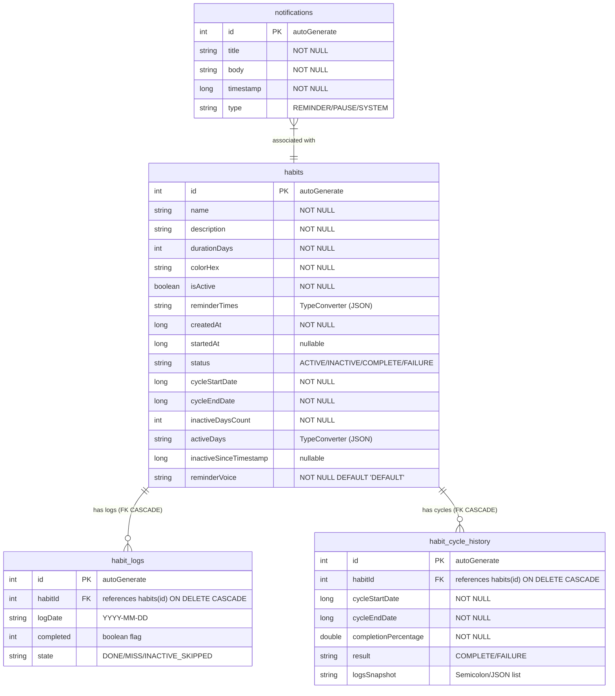

# 08_DATABASE — هيكل قاعدة البيانات المحلية / Local Room Database Design

## التقنية وتكوين التخزين / Local Storage Engine

يعتمد تطبيق **HabitFlow** بالكامل على التخزين المحلي (Offline-First) باستخدام مكتبة **Room Persistence** المعتمدة على محرك **SQLite** المحلي. يتم تكوين قاعدة البيانات في فئة `HabitDatabase.kt` بالإصدار الحالي **12**.

**HabitFlow** is local-first. Structured storage is managed via **Room over SQLite**. The database file is constructed dynamically inside `HabitDatabase.kt` at schema version **12**.

---

## جداول قاعدة البيانات ومخطط الكيانات / Database Entities

تحتوي قاعدة البيانات على 4 جداول رئيسية:

The database schema is comprised of these 4 tables:

---

## تفاصيل الجداول والأعمدة الفعلي / Detailed Table Specifications

### 1. جدول العادات (`habits`)
يخزن إعدادات وهيكل العادة ودورة عملها الحالية:
* `id` (`Int`): المفتاح الأساسي التلقائي. (ملاحظة: وثائق التحليل القديمة ذكرت أنه UUID وهذا خطأ).
* `name` (`String`), `description` (`String`).
* `colorHex` (`String`): القيمة السداسية للون المستخدم في واجهة المظهر.
* `durationDays` (`Int`): طول دورة العادة المجدولة بالأيام.
* `isActive` (`Boolean`): حالة الجدولة النشطة الحالية للتذكيرات.
* `status` (`String`): حالة دورة العادة الحالية (`ACTIVE`, `INACTIVE`, `COMPLETE`, `FAILURE`).
* `reminderTimes` (`List<String>`): أوقات التنبيه المجدولة. يتم تخزينها بصيغة قائمة سلسلة نصية ويتم تحويلها تلقائياً عبر `Converters.kt`.
* `activeDays` (`List<String>`): أيام التفعيل الأسبوعية.
* `reminderVoice` (`String`): صوت منبه التذكير المختار.

### 2. جدول السجلات اليومية (`habit_logs`)
يسجل حالة التزام العادة يومياً. يحتوي على قيود المفتاح الخارجي المرتبط بجدول العادات مع ميزة الحذف التلقائي المتتالي (`ON DELETE CASCADE`):
* `id` (`Int`): المفتاح الأساسي التلقائي.
* `habitId` (`Int`): المفتاح الخارجي المرتبط بـ `habits.id`.
* `logDate` (`String`): التاريخ التقويمي بصيغة `YYYY-MM-DD`.
* `completed` (`Int`): علم تشغيلي يمثل إكمال النشاط (0 = لم يكتمل، 1 = مكتمل).
* `state` (`String`): حالة السجل اليومية (`DONE` للمكتمل، `MISS` للغائب، `INACTIVE_SKIPPED` لليوم غير المجدول أو الموقوف مؤقتاً).

---

## فهارس قاعدة البيانات والتحسين / Database Indices & WAL Mode

* **الفهارس (Indexes)**:
  * فهرس للوصول السريع للعادات النشطة: `index_habits_isActive` على حقل `isActive`.
  * فهارس للتواريخ ومواعيد الإنشاء: `index_habits_createdAt` و `index_habits_startedAt`.
  * مفتاح فريد لـ `habit_logs`: فهرس فريد مركب `index_habit_logs_habitId_logDate` لمنع تكرار وجود أكثر من سجل لنفس العادة في نفس التاريخ التقويمي.
* **وضع WAL (Write-Ahead Logging)**:
  مفعّل تلقائياً لتسريع عمليات قراءة وكتابة البيانات في خيوط المعالجة المتزامنة IO، وتقليل احتمالية قفل الجداول SQLite.
* **التنظيف وتفريغ المساحة (Incremental Vacuum)**:
  مفعّل عبر أداة `PRAGMA auto_vacuum = INCREMENTAL` مع تشغيل دوري أسبوعي لـ `DbVacuumWorker` لتنظيف وتصغير حجم ملف قاعدة البيانات في الذاكرة التخزينية.

---

## تاريخ عمليات هجرة البيانات / Schema Migration Path

شهد مخطط قاعدة البيانات 12 إصداراً. فيما يلي ملخص للهجرات المعرّفة في `HabitDatabase`:

* **1 ← 2**: إضافة حقول الحالة `status` وتواريخ الدورة `cycleStartDate` و `cycleEndDate` وجدول الأرشيف `habit_cycle_history`.
* **2 ← 3**: إضافة قيود المفتاح الخارجي `ForeignKey` مع حذف متتالي `ON DELETE CASCADE`.
* **3 ← 4**: إضافة فهارس البحث.
* **4 ← 5**: إعادة تهيئة التذكيرات.
* **5 ← 6**: إضافة حقل أيام العمل الأسبوعية `activeDays`.
* **6 ← 7**: إضافة فهرس بحث على حقل `startedAt`.
* **7 ← 8**: (هجرة فارغة لتأمين المخطط).
* **8 ← 9**: إنشاء جدول الإشعارات `notifications`.
* **9 ← 10**: إضافة حقل وقت التوقف الأخير `inactiveSinceTimestamp`.
* **10 ← 11**: إضافة حقل صوت المنبه المخصص `reminderVoice`.
* **11 ← 12**: تحديث وتجديد هاش الهوية.

---

## قسم التحقق والأدلة / Verification & Evidence

* **Confidence Score / نسبة الثقة**: 100%
* **Evidence / الأدلة**:
  - تم التحقق من الكود المصدري لكيانات Room وتطبيق المخطط البرمجي وواجهات DAO وقائمة الهجرات المعرفة.
* **Files Used / الملفات المستخدمة**:
  - [HabitEntity.kt](app/src/main/java/com/example/core/model/entity/HabitEntity.kt)
  - [HabitLogEntity.kt](app/src/main/java/com/example/core/model/entity/HabitLogEntity.kt)
  - [HabitCycleHistoryEntity.kt](app/src/main/java/com/example/core/model/entity/HabitCycleHistoryEntity.kt)
  - [HabitDatabase.kt](app/src/main/java/com/example/core/database/HabitDatabase.kt)
* **Verification Status / حالة التحقق**: VERIFIED / مؤكد
