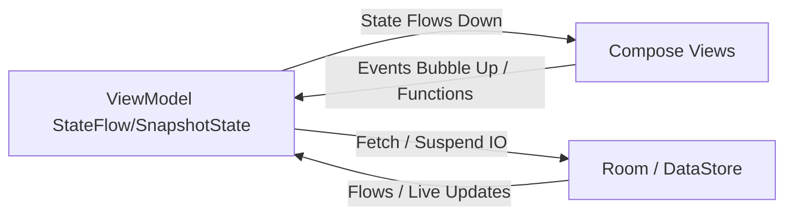

# 09_STATE_MANAGEMENT — إدارة الحالة وهندسة التفاعل / State Management

## نظرة عامة على تدفق الحالات / State Propagation Overview

يتبع تطبيق **HabitFlow** نمط تدفق البيانات أحادي الاتجاه (Unidirectional Data Flow - UDF) لتبادل الحالات البرمجية ومعالجة التفاعلات:

The application enforces a Unidirectional Data Flow (UDF) model where state flows down from ViewModels to UI and actions bubble up from Composable functions:



---

## أدوات إدارة الحالات البرمجية / State Mechanisms & Utilities

تتألف إدارة الحالة في الكود من الأدوات التقنية التالية:

### 1. تدفق البيانات القابل للرصد (`StateFlow`)
* **الوظيفة**: تجميع بيانات واجهة المستخدم وإرسالها ككتلة غير قابلة للتعديل (Immutable State) مثل فئة البيانات `AllHabitsUiState`.
* **مثال في الكود**:
  ```kotlin
  private val _uiState = MutableStateFlow(AllHabitsUiState())
  val uiState: StateFlow<AllHabitsUiState> = _uiState.asStateFlow()
  ```
  تراقب واجهة الكومبوز هذا المتغير عبر `collectAsState()` أو `collectAsStateWithLifecycle()` لإعادة رسم الشاشة عند التعديل.

### 2. الحالات الذكية للمجموعات (`SnapshotStateList` & `SnapshotStateMap`)
* **الوظيفة**: لتفادي تجمد الواجهة وإعادة رسم القوائم بالكامل (Full List Recomposition) عند تعديل أو نقر سطر واحد، يستخدم التطبيق في `HomeViewModel` فئات `mutableStateListOf` و `mutableStateMapOf`. يضمن هذا أن التغيير في سطر العادة يؤثر ويعيد رسم الخلية المقابلة له فقط (Row-level recomposition).
* **مثال في الكود**:
  ```kotlin
  private val _habits = mutableStateListOf<HabitWithProgress>()
  val habits: List<HabitWithProgress> get() = _habits
  ```

### 3. الأحداث الفردية السريعة (`SharedFlow`)
* **الوظيفة**: لبث أحداث فورية تحدث لمرة واحدة (مثل التنقل أو عرض الوجبات المنزلقة Snackbar) ولا يجب حفظها في الحالة المستقرة للملف.
* **مثال في الكود**:
  ```kotlin
  private val _uiEvent = MutableSharedFlow<UiEvent>()
  val uiEvent = _uiEvent.asSharedFlow()
  ```
  يتم استقبال الأحداث في الكومبوز باستخدام `LaunchedEffect` لضمان معالجتها لمرة واحدة.

### 4. حفظ البيانات الثابتة في الخلفية (Preference DataStore)
* يدير كائن `UserPreferencesManager.kt` تيار البيانات والتدفقات الخاصة بالسمات العامة واللغات وصور وملفات المستخدم، مما يضمن تدفق الحالة وحفظها التلقائي عبر الجلسات والتشغيل البارد للتطبيق.

---

## نطاقات إعادة الرسم وتحسين كومبوز / Recomposition Scopes & Optimizations

* **Immutable Annotation**: تم تمييز فئات الحالات الرسومية (مثل `AddHabitUiState`, `DetailUiState`, `AllHabitsUiState`) بالرمز `@Immutable` لإعلام محرك كومبوز أن محتوى المتغيرات مستقر ولا يتغير بشكل مفاجئ، مما يتيح تجاوز تكرار الرسم غير الضروري (Smart Recomposition Skipping).
* **DisposableEffect Lifecycles**: يتم استخدام `DisposableEffect` للتحكم بقنوات بث النظام ومرئيات شريط التنقل الشفاف، وربطها بدورة حياة الشاشات وإخلائها فور التدمير لمنع تسريب السياقات في الذاكرة العشوائية.

---

## قسم التحقق والأدلة / Verification & Evidence

* **Confidence Score / نسبة الثقة**: 100%
* **Evidence / الأدلة**:
  - تم التحقق من الكود المصدري لنماذج العرض وحزم الحالات واستخدامات SnapshotStateList و Immutable Annotations.
* **Files Used / الملفات المستخدمة**:
  - [HomeViewModel.kt](app/src/main/java/com/example/presentation/screens/home/HomeViewModel.kt#L18-L60)
  - [AllHabitsViewModel.kt](app/src/main/java/com/example/presentation/screens/all/AllHabitsViewModel.kt#L17-L40)
  - [UserPreferencesManager.kt](app/src/main/java/com/example/data/preferences/UserPreferencesManager.kt#L36-L114)
* **Verification Status / حالة التحقق**: VERIFIED / مؤكد
