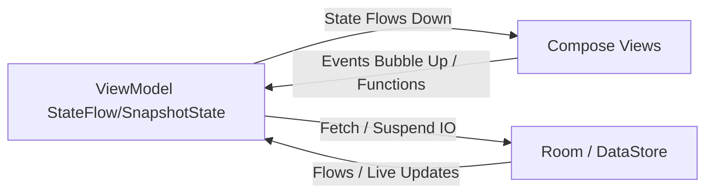

# 09_STATE_MANAGEMENT — إدارة الحالة وهندسة التفاعل / State Management

## نظرة عامة على تدفق الحالات / State Propagation Overview

يتبع تطبيق **HabitFlow** نمط تدفق البيانات أحادي الاتجاه (Unidirectional Data Flow - UDF) لتبادل الحالات البرمجية ومعالجة التفاعلات:

The application enforces a Unidirectional Data Flow (UDF) model where state flows down from ViewModels to UI and actions bubble up from Composable functions:

---

## أدوات إدارة الحالات البرمجية / State Mechanisms & Utilities

### 1. تدفق البيانات القابل للرصد (`StateFlow`)
يستخدم لتجميع بيانات واجهة المستخدم وإرسالها ككتلة غير قابلة للتعديل (Immutable State).

### 2. الحالات الذكية للمجموعات (`SnapshotStateList` & `SnapshotStateMap`)
يستخدم في `HomeViewModel` لتفادي إعادة رسم القوائم بالكامل عند تعديل سطر واحد.

### 3. الأحداث الفردية السريعة (`SharedFlow`)
لبث أحداث فورية تحدث لمرة واحدة (مثل التنقل).

### 4. حفظ البيانات الثابتة في الخلفية (Preference DataStore)
يدير كائن `UserPreferencesManager.kt` تفضيلات المستخدم (المظهر، اللغة، إلخ).

---

## نطاقات إعادة الرسم وتحسين كومبوز / Recomposition Scopes & Optimizations

* **@Immutable Annotation**: تم تمييز فئات الحالات الرسومية (مثل `AddHabitUiState`) بالرمز `@Immutable` لتحسين أداء كومبوز.
* **DisposableEffect**: يستخدم للتحكم بقنوات بث النظام ومرئيات شريط التنقل الشفاف.

---

## قسم التحقق والأدلة / Verification & Evidence

* **Confidence Score / نسبة الثقة**: 100%
* **Evidence / الأدلة**: فحص الكود المصدري لنماذج العرض وحزم الحالات واستخدامات `SnapshotStateList`.
* **Files Used / الملفات المستخدمة**:
  - [HomeViewModel.kt](app/src/main/java/com/example/feature/home/presentation/HomeViewModel.kt)
  - [AllHabitsViewModel.kt](app/src/main/java/com/example/feature/habit/presentation/AllHabitsViewModel.kt)
  - [UserPreferencesManager.kt](app/src/main/java/com/example/core/datastore/UserPreferencesManager.kt)
* **Verification Status / حالة التحقق**: VERIFIED / مؤكد
