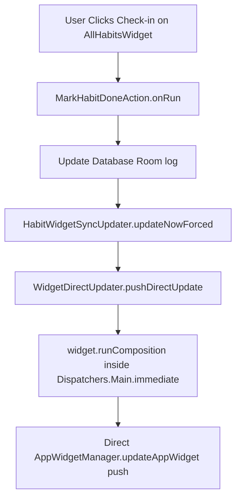

# 12_WIDGET_SYSTEM — نظام قطع الشاشة التفاعلية / Home Screen Widget System

## نظرة عامة على تصميم قطع الشاشة / Glance Widget System Overview

يحتوي تطبيق **HabitFlow** على نظام قطع تفاعلية مميز للشاشة الرئيسية مبني بالكامل على تقنية **Glance AppWidgets** المدمجة مع **Material 3**. 

**HabitFlow** implements 3 home screen widgets utilizing **Android Glance**. They render customizable Compose layouts natively transformed into standard `RemoteViews` layouts:

---

## أنواع قطع الشاشة الرسومية / Types of Placed Widgets

1. **AllHabitsWidget (قطعة العادات المجدولة)**:
   * *الوظيفة*: تعرض قائمة بأهم 6 عادات نشطة اليوم مع مستويات الإنجاز والتقدم الكلي المنجز. تحتوي على حلقات تقدم دائرية زجاجية مخصصة وزر إكمال سريع لكل عادة.
2. **InactiveHabitsWidget (قطعة العادات المتوقفة)**:
   * *الوظيفة*: تعرض أحدث العادات التي تم إيقافها مؤقتاً لتذكير المستخدم بالعودة لتنشيطها، مع توضيح تواريخ وعدد أيام التوقف الفعلي.
3. **HabitStatsSummaryWidget (قطعة إحصائيات الالتزام)**:
   * *الوظيفة*: تعرض ملخصاً بيانياً وإحصائياً للمستخدم لحثه ومساعدته في متابعة الانتظام الكلي لعاداته.

---

## ميزات التصميم والغطاء الزجاجي / Glassmorphism Design Pattern

تتبع جميع قطع الواجهة نمط بناء بصرياً ثلاثي الطبقات متناسقاً مع مظهر التطبيق الزجاجي (Glassmorphism):
* **الطبقة الأولى (الحاوية الخارجية)**: تحدد شكل الحدود الجانبية والزوايا المنحنية الدائرية (`cornerRadius`).
* **الطبقة الثانية (الخلفية الداكنة)**: تطبيق لون خلفية داكن شبه شفاف لحماية النص والمحافظة على التباين البصري والوضوح بغض النظر عن صورة خلفية شاشة المستخدم.
* **الطبقة الثالثة (الغشاء الملون)**: تطبيق لمسة لون خفيفة (`glassTint` بقيمة شفافية ~15%) تعكس اللون المميز للعادة أو التطبيق لتوحي بتأثير الزجاج الحقيقي.

---

## التحديث الفوري المباشر / Direct Update Bypass Optimization

تفرض مكتبة Glance التقليدية قفل جلسات (Session Lock) قد يؤخر رسم وتعديل الويدجت لمدة تصل لـ 45 ثانية لتأمين البطارية. لحل هذه المشكلة وتأمين واجهة فورية التحديث والاستجابة لنقرات المستخدم:
* **التخطي الفوري (Bypass)**: يعتمد التطبيق على فئة `WidgetDirectUpdater.pushDirectUpdate()`.
* **الآلية**: تقوم الدالة باستدعاء مباشر لـ `widget.runComposition(context, glanceId).first()` لتوليد الـ `RemoteViews` يدوياً على خيط العرض الأساسي `Dispatchers.Main.immediate` ثم دفعها مباشرة لـ `AppWidgetManager.updateAppWidget()`.

## التحديث المجمع المهادن / Debounced Widget Sync

عند قيام المستخدم بإنجاز عادات متعددة بشكل سريع ومتلاحق، يتم تصفية وتجميع مكالمات تحديث الويدجت عبر فئة `HabitWidgetSyncUpdater.updateNow()`. تقوم الدالة بتأجيل عملية التحديث بمهلة قدرها **3 ثوانٍ** (`DEBOUNCE_MS = 3000L`). أي استدعاء جديد يلغي الجدولة السابقة ويعيد الجدولة لمرة واحدة لحفظ معالج الهاتف من تكرار رسم الواجهات المتلاحق.

---

## قسم التحقق والأدلة / Verification & Evidence

* **Confidence Score / نسبة الثقة**: 100%
* **Evidence / الأدلة**:
  - تم فحص كود التحديث المباشر `WidgetDirectUpdater.kt` وآلية دمج التحديثات `HabitWidgetSyncUpdater.kt` وطريقة رسم الكامفاس لحلقات التقدم المكتوبة.
* **Files Used / الملفات المستخدمة**:
  - [WidgetDirectUpdater.kt](app/src/main/java/com/example/widget/WidgetDirectUpdater.kt#L19-L59)
  - [HabitWidgetSyncUpdater.kt](app/src/main/java/com/example/widget/HabitWidgetSyncUpdater.kt#L16-L121)
  - [AllHabitsWidget.kt](app/src/main/java/com/example/widget/AllHabitsWidget.kt)
* **Verification Status / حالة التحقق**: VERIFIED / مؤكد
