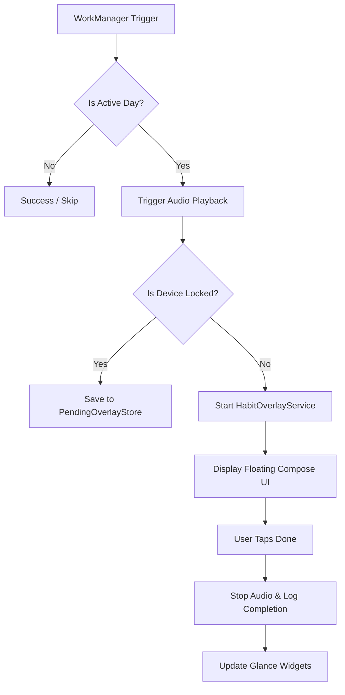

# 13_REMINDER_SYSTEM — نظام التذكيرات الصوتي والعائم / Audio & Floating Reminder System

## نظرة عامة / Overview

يعتبر نظام التذكيرات في **HabitFlow** هو الميزة الأكثر تعقيداً وأهمية، حيث يجمع بين عمال `WorkManager` للتوقيت، وخدمات `Foreground Services` لضمان الاستمرارية، و `WindowManager` لعرض واجهات عائمة (Overlays)، ومحركات `TTS/MediaPlayer` للتنبيه الصوتي.

The reminder system is the core of **HabitFlow**. It orchestrates `WorkManager` for scheduling, `Foreground Services` for reliability, `WindowManager` for interactive floating overlays, and a dual-engine `TTS/MediaPlayer` for audio alerts.

---

## المكونات الرئيسية / Core Components

### 1. مجدول المهام (`HabitReminderWorker`)
المسؤول عن جدولة التذكيرات باستخدام `WorkManager`. يتم استخدام `PeriodicWorkRequestBuilder` بفترة 24 ساعة لضمان تكرار التنبيه يومياً.
* **التوقيت**: يتم حساب `initialDelay` بدقة بناءً على الوقت الحالي والوقت المستهدف.
* **التحقق**: قبل التشغيل، يتحقق العامل من كون اليوم الحالي هو يوم عمل نشط للعادة (`activeDays`).

### 2. واجهة العرض العائمة (`HabitOverlayService`)
خدمة أمامية (Foreground Service) تقوم برسم واجهة مستخدم Compose فوق كافة التطبيقات.
* **التقنية**: تستخدم `WindowManager` مع نوع `TYPE_APPLICATION_OVERLAY`.
* **التفاعل**: تدعم السحب (Dragging) والرد السريع (Mark Done) الذي يقوم بتحديث قاعدة البيانات والقطع التفاعلية فوراً.
* **الانتظار الذكي**: إذا كان الجهاز مغلقاً (Locked)، يتم تخزين الطلب في `PendingOverlayStore` وعرضه فور فتح القفل عبر `HabitBackgroundService`.

### 3. محرك الصوت (`ReminderAudioRepository`)
يدير عملية التنبيه الصوتي مع دعم محركين:
* **TTS Engine**: يقوم بنطق اسم العادة ("حان وقت [اسم العادة]").
* **Alarm Engine**: يقوم بتشغيل نغمة المنبه الافتراضية للنظام باستخدام `USAGE_ALARM`.
* **المرونة**: يتم التبديل تلقائياً إلى محرك المنبه إذا كان محرك جوجل للنطق غير مثبت أو غير مفعل.

---

## تدفق عملية التنبيه / Execution Flow

---

## نظام التنبيه الذكي عند فتح القفل / Catch-up System

تعتمد الموثوقية الفائقة للتطبيق على `HabitBackgroundService` الذي يعمل بشكل دائم في الخلفية:
1. يستمع لإشارة `ACTION_USER_PRESENT` (فتح قفل الجهاز).
2. يقوم بفحص أي تذكيرات "فاتت" خلال فترة غلق الجهاز.
3. يقوم بعرض النوافذ العائمة المتراكمة بالتتابع لضمان عدم ضياع أي مهمة.

---

## قسم التحقق والأدلة / Verification & Evidence

* **Confidence Score / نسبة الثقة**: 100%
* **Evidence / الأدلة**:
  - كود `HabitReminderWorker` لجدولة WorkManager.
  - كود `HabitOverlayService` واستخدام `WindowManager`.
  - كود `HabitBackgroundService` لمراقبة فتح القفل.
* **Files Used / الملفات المستخدمة**:
  - [HabitReminderWorker.kt](app/src/main/java/com/example/core/infrastructure/worker/HabitReminderWorker.kt)
  - [HabitOverlayService.kt](app/src/main/java/com/example/core/infrastructure/overlay/HabitOverlayService.kt)
  - [HabitBackgroundService.kt](app/src/main/java/com/example/core/infrastructure/service/HabitBackgroundService.kt)
  - [ReminderAudioRepositoryImpl.kt](app/src/main/java/com/example/core/repository/ReminderAudioRepositoryImpl.kt)
* **Verification Status / حالة التحقق**: VERIFIED / مؤكد
