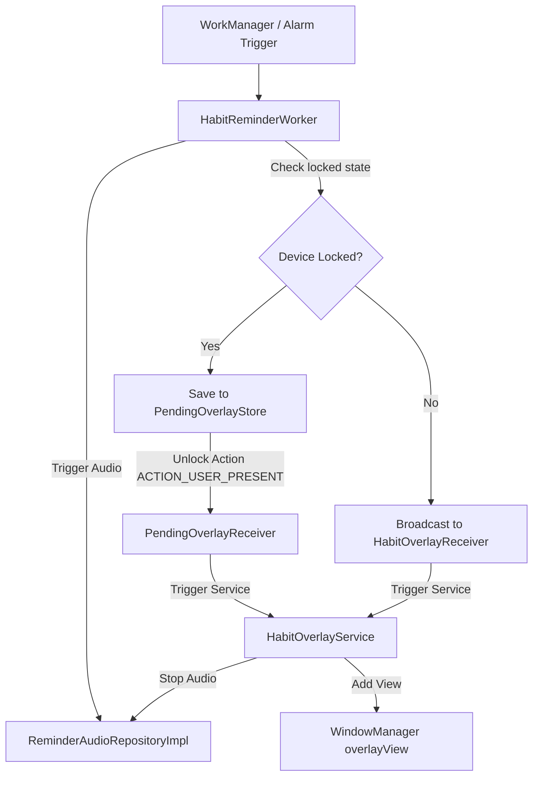

# 13_REMINDER_SYSTEM — نظام التذكير والإنذارات الموثق / Reminder System Specification

## مكونات التذكير الصوتي والمرئي / Audio & Visual Reminder Pipeline

يستخدم تطبيق **HabitFlow** تركيبة صوتية مرئية متطورة لتأمين انطلاق التذكيرات بمواعيد العادات النشطة:

The reminder architecture connects alarm scheduling, background triggers, audio engines, and window overlay presentation:

---

## 1. محرك التذكير الصوتي المشترك / Combined Audio Engine

يتحكم كائن `ReminderAudioRepositoryImpl.kt` بعملية النطق والمنبهات عبر دمج محركين فرعيين:

* **TextToSpeechEngine (محرك نطق النصوص)**:
  * *الوظيفة*: ينطق بصوت آلي قالب نصوص مخصص يحتوي على اسم العادة (مثل: *"حان وقت القيام بـ تفعيل القراءة"*).
  * *التحكم*: يربط بالـ `ReminderSpeechManager` ويقود `ReminderSpeechEngine` الذي يؤمن قفل الصوت `AudioAttributes.USAGE_ALARM` ليرفع الصوت عبر قناة المنبه التابعة للنظام حتى لو كان الهاتف صامتاً.
  * *دورة حياة TTS*: يتضمن نظام التكلم مهلة أمان قصوى مدتها **30 ثانية** لإنهاء النطق تلقائياً وتفادي تعليق المحركات، مع إغلاق وتحرير كلي للمحرك عند عدم الاستخدام لمدة دقيقة واحدة (`IDLE_TIMEOUT_MS = 60_000L`) لحماية الذاكرة العشوائية.
* **AlarmSoundEngine (محرك رنين المنبه)**:
  * *الوظيفة*: تشغيل نغمة المنبه الافتراضية للجهاز أو نغمة مخصصة مسجلة عبر `Uri`.
  * *التحكم*: يستخدم كائن `MediaPlayer` مدمجاً مع خصائص `USAGE_ALARM` ويكرر تشغيل النغمة بشكل حلقي مستمر حتى يغلق المستخدم النافذة العائمة.

---

## 2. شاشات التنبيه العائمة / WindowManager Overlays

* **البنية والتداخل**: عند إطلاق التذكير والهاتف غير مقفل، تقوم خدمة `HabitOverlayService` بحقن شاشة ComposeView داخل الـ `WindowManager` باستخدام نوع تخطيط `TYPE_APPLICATION_OVERLAY`.
* **الحمل والموثوقية**: نظراً لأن خدمات أندرويد لا تملك تسلسلاً للمكونات الرسومية natively، تؤسس الفئة كائناً خاصاً باسم `ServiceLifecycleOwner` يحاكي الحفظ والاسترجاع للواجهات الرسومية، مما يمكن Jetpack Compose من العمل والاستقرار بسلاسة ودون انهيارات.
* **سحب وتحريك النافذة**: تدعم واجهة التنبيه ميزات الحركة الحرة وسحب البطاقة الرسومية (Drag-to-reposition physics) عبر رصد أحداث اللمس `setOnTouchListener` لتبتعد عن منتصف الشاشة وتتيح للمستخدم رؤية ما خلفها.

---

## 3. تأجيل المنبهات عند قفل الهاتف / Lock-Screen Catch-up Queue

* **مخزن التأجيل**: عند استيقاظ عامل التذكير في الخلفية ورصد أن الهاتف مغلق بواسطة قفل الشاشة، يتم تأجيل إظهار النافذة العائمة فوراً وكتابة بياناتها داخل `PendingOverlayStore` المبني بـ DataStore.
* **مستقبل فتح القفل (`PendingOverlayReceiver`)**: يستمع للبث العام للنظام `ACTION_USER_PRESENT` عند فتح قفل الهاتف؛ حيث يقوم فوراً بقراءة وتفريغ محتويات مخزن التنبيهات الموقوفة وبدء تشغيل `HabitOverlayService` لعرض منبهات العادات التي فاتت المستخدم أثناء قفل هاتفه بالترتيب الزمني الصحيح.

---

## قسم التحقق والأدلة / Verification & Evidence

* **Confidence Score / نسبة الثقة**: 100%
* **Evidence / الأدلة**:
  - تم فحص كود التكلم وإدارة دورة حياة الـ TTS وملفات التهيئة والتحكم بـ WindowManager.
* **Files Used / الملفات المستخدمة**:
  - [ReminderSpeechEngine.kt](app/src/main/java/com/example/speech/ReminderSpeechEngine.kt#L191-L252)
  - [ReminderSpeechManager.kt](app/src/main/java/com/example/speech/ReminderSpeechManager.kt#L30-L50)
  - [HabitOverlayService.kt](app/src/main/java/com/example/overlay/HabitOverlayService.kt#L118-L248)
  - [PendingOverlayReceiver.kt](app/src/main/java/com/example/overlay/PendingOverlayReceiver.kt)
* **Verification Status / حالة التحقق**: VERIFIED / مؤكد
